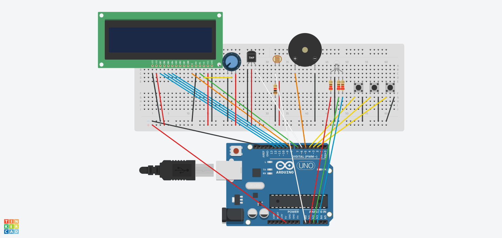

# Embedded Environmental Monitoring System

## Overview

This project implements a modular embedded system on Arduino for monitoring environmental conditions, including temperature, humidity, and ambient light. The system provides real-time feedback through an LCD display, visual and audible alerts, and a serial command interface.

## Features

* Periodic sensing of temperature, humidity, and light levels
* Configurable thresholds for all monitored parameters
* Real-time alert system using RGB LED and buzzer
* LCD-based user interface with menu navigation
* Button-based input with software debouncing
* Serial command interface for monitoring and configuration
* EEPROM-based persistent storage with validation
* Non-blocking cooperative task scheduler

## System Architecture

The system is organized into independent modules coordinated by a scheduler. Each module operates on shared system state.

Main components:

* Scheduler: Executes tasks at fixed intervals
* Sensor Module: Reads environmental data
* Display Module: Updates LCD output
* Alert Module: Evaluates thresholds and triggers alerts
* Input Module: Handles button input and menu navigation
* Serial Module: Processes commands from serial interface
* Storage Module: Manages EEPROM persistence

## Hardware Components

* Arduino Uno (or compatible board)
* DHT11 temperature and humidity sensor
* Light-dependent resistor (LDR)
* 16x2 LCD (parallel interface)
* RGB LED
* Buzzer
* Three push buttons (menu, increment, decrement)
* Supporting resistors and wiring

## Pin Configuration

| Component    | Pin    |
| ------------ | ------ |
| DHT11        | D6     |
| LCD RS       | D7     |
| LCD EN       | D8     |
| LCD D4–D7    | D9–D12 |
| Light Sensor | A0     |
| RGB LED      | A1–A3  |
| Buzzer       | D5     |
| Buttons      | D2–D4  |

## Circuit Diagram

## System Behavior

### Sensor Processing

The system periodically reads:

* Temperature (°C)
* Humidity (%)
* Light level (analog value)

Sensor data is validated to detect faults or missing data.

### Alert System

Sensor values are compared against configurable thresholds. Hysteresis is applied to prevent rapid toggling due to noise.

Alert states include:

* NORMAL
* WARNING
* SENSOR FAULT
* NO DATA

Each state controls the RGB LED and buzzer behavior.

### User Interface

* LCD displays sensor data or configuration screens
* Buttons allow navigation between modes and adjustment of thresholds

### Serial Interface

Provides a secondary interface for monitoring and configuration.

## Serial Commands

get: Displays current threshold values

save: Stores thresholds to EEPROM

defaults: Restores default threshold values

status: Displays system status, sensor data, and thresholds

set temp X: Sets temperature threshold

set hum X: Sets humidity threshold

set light X: Sets light threshold

Invalid data results in fallback to default values.
